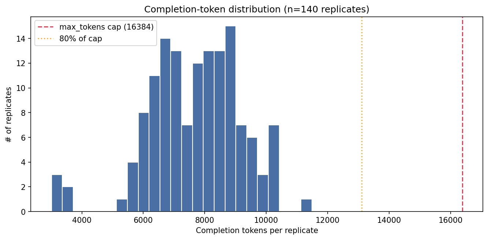
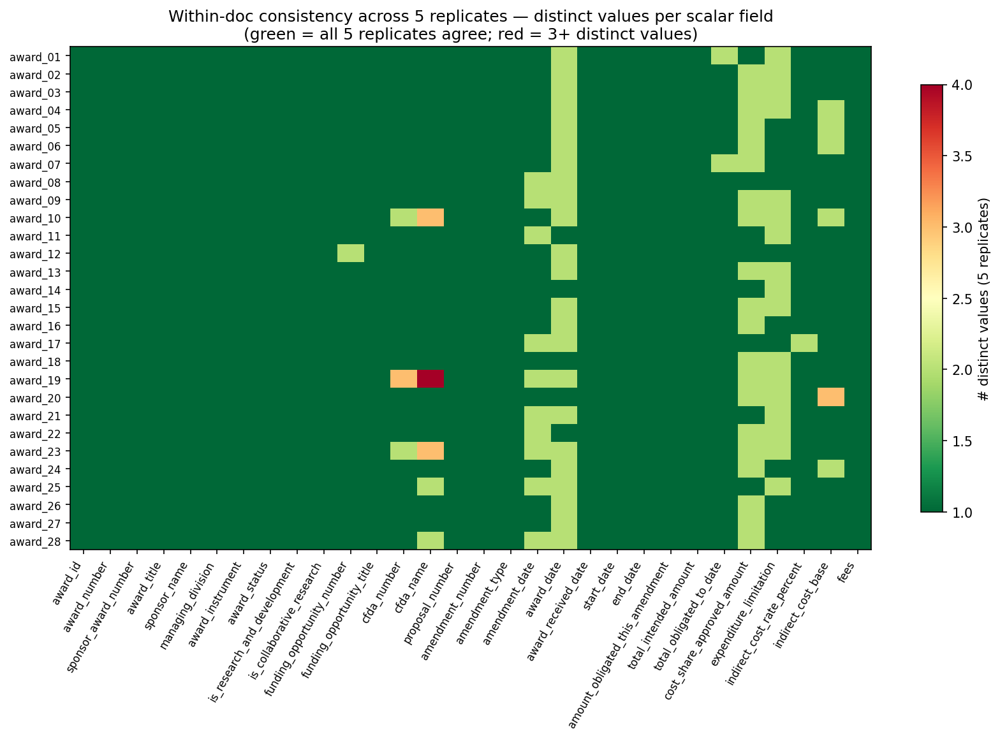
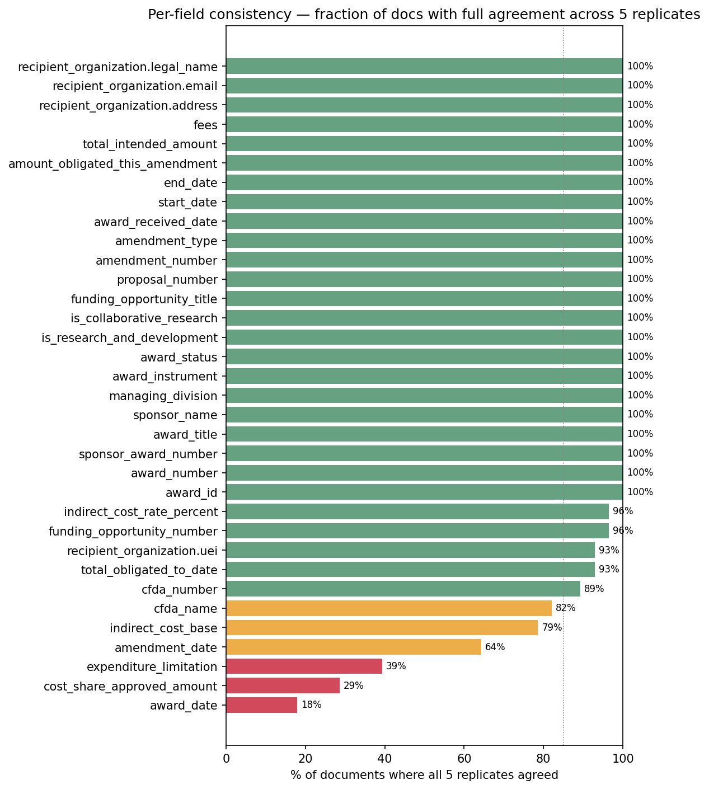
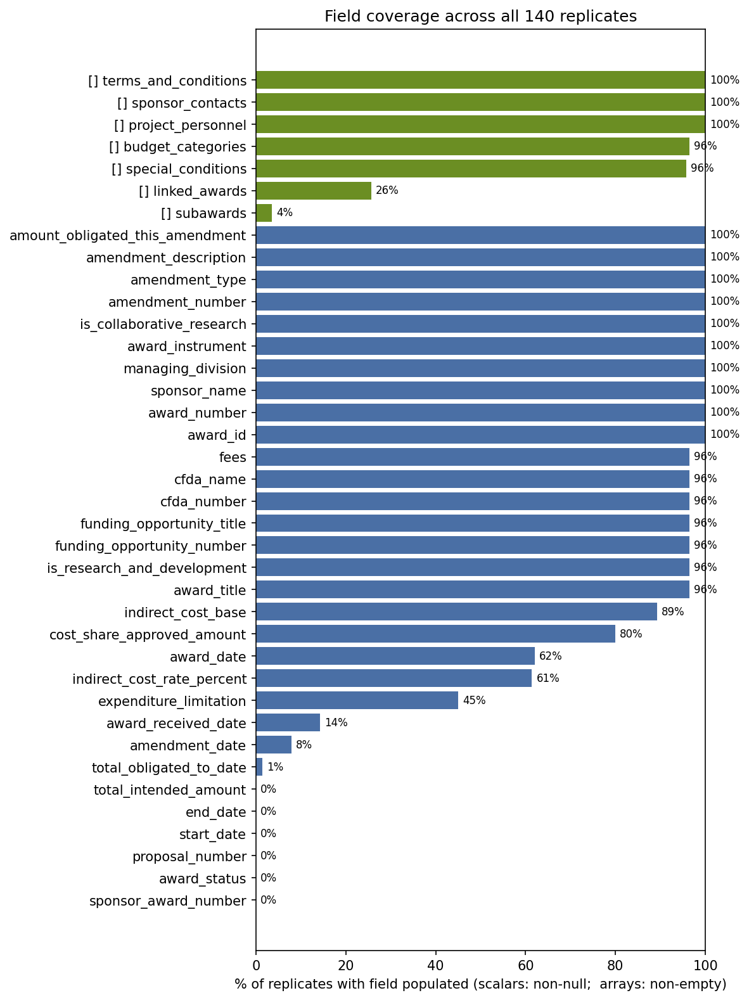

# Evaluation run — `2026-04-20-gpt-oss-120b-json_object`

**Date:** 2026-04-20 15:40 UTC  
**Model:** `openai/gpt-oss-120b`  
**OCR:** `mindrouter` (Mindrouter `/v1/ocrmd`, dots.OCR backend)  
**Prompt:** `prompt.md` — sha256 `ceec486b1fe2`  
**Temperature:** 0.1  
**Replicates per doc:** 5  
**Documents:** 28

## 1. Run-level headline

- **Success rate:** 140/140 (100.0%) — 0 API errors, 0 JSON-parse errors.
- **OCR latency:** p50 0.0s, p95 0.0s (min 0.0s, max 0.0s).
- **Chat latency:** p50 62.7s, p95 83.4s (min 17.3s, max 97.0s).
- **Prompt tokens:** p50 5678, p95 6306 (min 4697, max 7226).
- **Completion tokens:** p50 7755, p95 10182, max **11484** (cap: 16384). 0 replicates over 80% of cap, 0 over 95%.



## 2. Structural validity (JSON Schema)

Validated every replicate against [`../../../schema.json`](../../../schema.json) with `jsonschema` (Draft 2020-12).

- **Strict pass rate:** 0/140 (0.0%)
- **Pass rate ignoring top-level extra keys:** 80/140 (57.1%) — this isolates structural/type errors from naming drift.

**Top-level naming drift — keys the model emits that the schema does not declare:**

| extra key emitted | occurrences | likely schema counterpart |
|---|---|---|
| `total_intended_award_amount` | 138 | `total_intended_amount` |
| `total_amount_obligated_to_date` | 136 | `total_obligated_to_date` |
| `total_approved_cost_share_or_matching_amount` | 123 | — |
| `award_period_end_date` | 40 | `end_date` |
| `award_period_start_date` | 40 | `start_date` |
| `period_of_performance_end_date` | 35 | `end_date` |
| `period_of_performance_start_date` | 35 | `start_date` |
| `period_of_performance_end` | 28 | — |
| `period_of_performance_start` | 28 | `start_date` |
| `award_period_of_performance_end_date` | 15 | `end_date` |
| `award_period_of_performance_start_date` | 15 | `start_date` |
| `award_period_end` | 13 | — |
| `award_period_start` | 13 | `start_date` |
| `total_approved_cost_share_amount` | 7 | — |
| `award_period_of_performance_end` | 7 | — |
| `award_period_of_performance_start` | 7 | `start_date` |
| `total_award_amount` | 2 | — |
| `total_approved_cost_share` | 2 | — |
| `award_end_date` | 1 | `end_date` |
| `award_start_date` | 1 | `start_date` |
| `total_cost_share_approved_amount` | 1 | `cost_share_approved_amount` |


**Required/declared top-level keys absent from outputs:**

| schema key missing | # replicates missing it (of 140) |
|---|---|
| `start_date` | 140 |
| `total_intended_amount` | 140 |
| `award_status` | 140 |
| `sponsor_award_number` | 140 |
| `proposal_number` | 140 |
| `end_date` | 140 |
| `total_obligated_to_date` | 138 |
| `amendment_date` | 129 |
| `award_date` | 53 |
| `cost_share_approved_amount` | 28 |
| `expenditure_limitation` | 12 |


**Top validation errors (error-key × occurrences):**

| rule @ pointer | count |
|---|---|
| `<root> :: additionalProperties` | 140 |
| `linked_awards/0 :: required` | 35 |
| `linked_awards/1 :: required` | 19 |
| `special_conditions/2/category :: enum` | 8 |
| `linked_awards/0 :: additionalProperties` | 6 |
| `award_title :: type` | 5 |
| `current_budget_period/end_date :: type` | 5 |
| `current_budget_period/start_date :: type` | 5 |
| `expenditure_limitation :: type` | 5 |
| `budget_categories/26/label :: minLength` | 4 |
| `budget_categories/25/label :: minLength` | 4 |
| `special_conditions/4/category :: enum` | 2 |
| `linked_awards/1 :: additionalProperties` | 2 |
| `special_conditions/3/category :: enum` | 1 |
| `special_conditions/0/category :: enum` | 1 |

**Documents with any schema-invalid replicate:**

| document | # invalid / 5 |
|---|---|
| award_01 | 5 |
| award_02 | 5 |
| award_03 | 5 |
| award_04 | 5 |
| award_05 | 5 |
| award_06 | 5 |
| award_07 | 5 |
| award_08 | 5 |
| award_09 | 5 |
| award_10 | 5 |
| award_11 | 5 |
| award_12 | 5 |
| award_13 | 5 |
| award_14 | 5 |
| award_15 | 5 |
| award_16 | 5 |
| award_17 | 5 |
| award_18 | 5 |
| award_19 | 5 |
| award_20 | 5 |
| award_21 | 5 |
| award_22 | 5 |
| award_23 | 5 |
| award_24 | 5 |
| award_25 | 5 |
| award_26 | 5 |
| award_27 | 5 |
| award_28 | 5 |

## 3. Within-doc consistency (5 replicates per doc)





### 3a. Per-field agreement rollup (top 15 worst)

| field | docs probed | % full agreement | 2 distinct | ≥3 distinct |
|---|---|---|---|---|
| `award_date` | 28 | **18%** | 23 | 0 |
| `cost_share_approved_amount` | 28 | **29%** | 20 | 0 |
| `expenditure_limitation` | 28 | **39%** | 17 | 0 |
| `amendment_date` | 28 | **64%** | 10 | 0 |
| `indirect_cost_base` | 28 | **79%** | 5 | 1 |
| `cfda_name` | 28 | **82%** | 2 | 3 |
| `cfda_number` | 28 | **89%** | 2 | 1 |
| `total_obligated_to_date` | 28 | **93%** | 2 | 0 |
| `recipient_organization.uei` | 28 | **93%** | 2 | 0 |
| `funding_opportunity_number` | 28 | **96%** | 1 | 0 |
| `indirect_cost_rate_percent` | 28 | **96%** | 1 | 0 |
| `award_id` | 28 | **100%** | 0 | 0 |
| `award_number` | 28 | **100%** | 0 | 0 |
| `sponsor_award_number` | 28 | **100%** | 0 | 0 |
| `award_title` | 28 | **100%** | 0 | 0 |

### 3b. Worst docs (most fields disagreeing)

| document | disagreeing / probed | % |
|---|---|---|
| award_10 | 6 / 41 | 15% |
| award_19 | 6 / 41 | 15% |
| award_23 | 6 / 41 | 15% |
| award_04 | 4 / 41 | 10% |
| award_09 | 4 / 41 | 10% |
| award_25 | 4 / 41 | 10% |
| award_28 | 4 / 41 | 10% |
| award_01 | 3 / 41 | 7% |
| award_02 | 3 / 41 | 7% |
| award_03 | 3 / 41 | 7% |

### 3c. Array-length stability across replicates

| array | mean CV | max CV | % docs stable (CV=0) | worst docs |
|---|---|---|---|---|
| `special_conditions` | 0.159 | 0.648 | 32% | award_06 ([1, 1, 2, 4, 1]); award_27 ([1, 1, 1, 0, 1]); award_26 ([7, 7, 4, 8, 5]) |
| `budget_categories` | 0.151 | 0.237 | 7% | award_12 ([30, 48, 48, 30, 30]); award_21 ([48, 30, 30, 30, 46]); award_22 ([30, 48, 46, 30, 30]) |
| `terms_and_conditions` | 0.111 | 0.197 | 14% | award_04 ([4, 3, 5, 3, 4]); award_02 ([4, 4, 3, 3, 3]); award_03 ([3, 4, 3, 4, 3]) |
| `linked_awards` | 0.065 | 0.816 | 89% | award_18 ([1, 1, 0, 1, 0]); award_12 ([0, 1, 1, 1, 1]); award_15 ([2, 0, 2, 2, 2]) |
| `sponsor_contacts` | 0.004 | 0.125 | 96% | award_12 ([3, 3, 3, 3, 4]) |
| `project_personnel` | 0.000 | 0.000 | 100% | — |
| `subawards` | 0.000 | 0.000 | 100% | — |

## 4. Field coverage



### 4a. Scalar fields — least-populated first

| field | % non-null | n / total |
|---|---|---|
| `sponsor_award_number` | 0% | 0 / 140 |
| `award_status` | 0% | 0 / 140 |
| `proposal_number` | 0% | 0 / 140 |
| `start_date` | 0% | 0 / 140 |
| `end_date` | 0% | 0 / 140 |
| `total_intended_amount` | 0% | 0 / 140 |
| `total_obligated_to_date` | 1% | 2 / 140 |
| `amendment_date` | 8% | 11 / 140 |
| `award_received_date` | 14% | 20 / 140 |
| `expenditure_limitation` | 45% | 63 / 140 |
| `indirect_cost_rate_percent` | 61% | 86 / 140 |
| `award_date` | 62% | 87 / 140 |
| `cost_share_approved_amount` | 80% | 112 / 140 |
| `indirect_cost_base` | 89% | 125 / 140 |
| `award_title` | 96% | 135 / 140 |

### 4b. Array fields — least-populated first

| array | % non-empty | n / total |
|---|---|---|
| `subawards` | 4% | 5 / 140 |
| `linked_awards` | 26% | 36 / 140 |
| `special_conditions` | 96% | 134 / 140 |
| `budget_categories` | 96% | 135 / 140 |
| `project_personnel` | 100% | 140 / 140 |
| `sponsor_contacts` | 100% | 140 / 140 |
| `terms_and_conditions` | 100% | 140 / 140 |

## Reproduction

```bash
python scripts/extract_only.py \
  --pdf-dir <local-pdf-dir> \
  --prompt components/nsf-award-notice-extraction-udm/prompt.md \
  --model openai/gpt-oss-120b \
  --ocr mindrouter \
  --replicates 5 \
  --max-tokens 16384 \
  --run-name 2026-04-20-gpt-oss-120b-json_object
```
