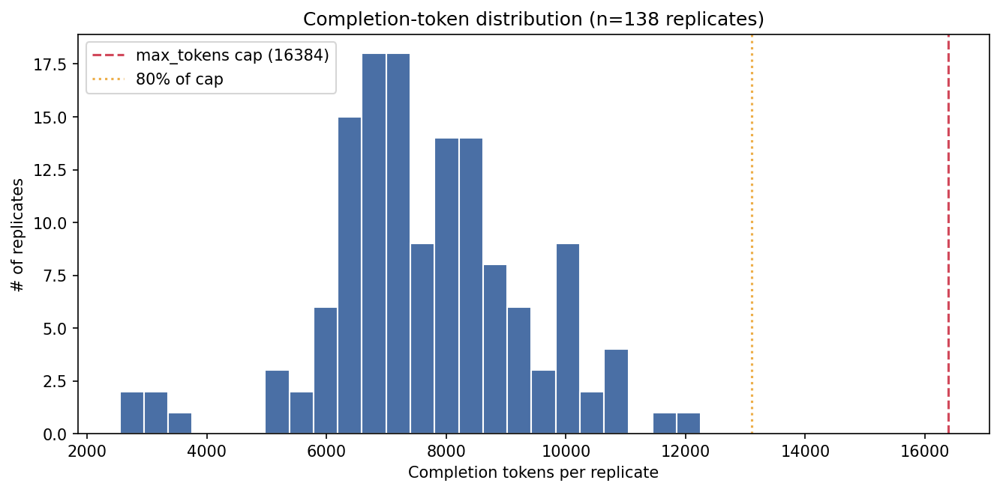
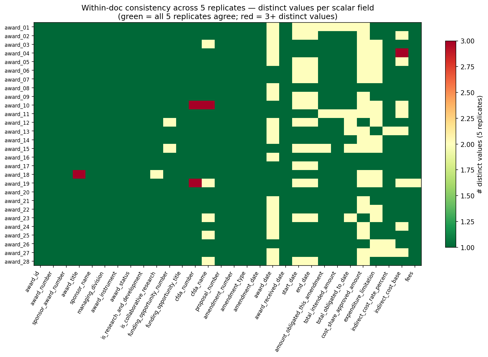
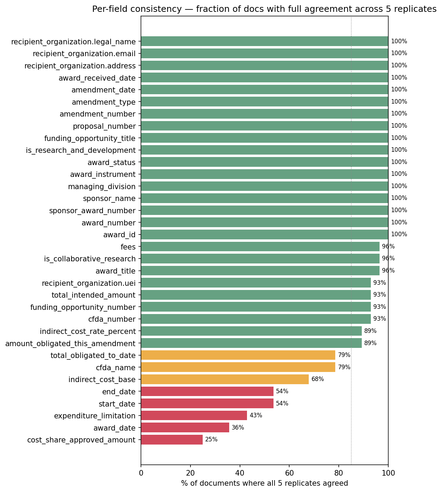
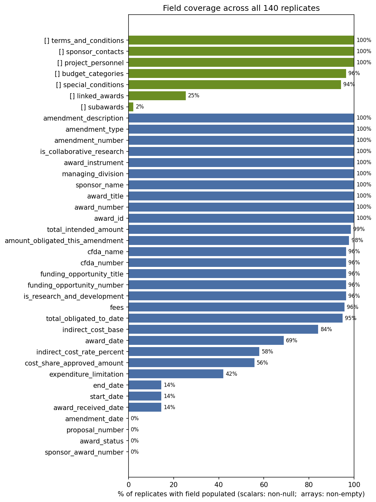

# Evaluation run — `2026-04-20-gpt-oss-120b-json_schema`

**Date:** 2026-04-20 15:52 UTC  
**Model:** `openai/gpt-oss-120b`  
**OCR:** `mindrouter` (Mindrouter `/v1/ocrmd`, dots.OCR backend)  
**Prompt:** `prompt.md` — sha256 `ceec486b1fe2`  
**Temperature:** 0.1  
**Replicates per doc:** 5  
**Documents:** 28

## 1. Run-level headline

- **Success rate:** 138/140 (98.6%) — 0 API errors, 2 JSON-parse errors.
- **OCR latency:** p50 0.0s, p95 0.0s (min 0.0s, max 0.0s).
- **Chat latency:** p50 63.5s, p95 89.7s (min 19.9s, max 98.2s).
- **Prompt tokens:** p50 5661, p95 6306 (min 4697, max 7226).
- **Completion tokens:** p50 7472, p95 10367, max **12256** (cap: 16384). 0 replicates over 80% of cap, 0 over 95%.



## 2. Structural validity (JSON Schema)

Validated every replicate against [`../../schema.json`](../../schema.json) with `jsonschema` (Draft 2020-12).

- **Strict pass rate:** 138/138 (100.0%)
- **Pass rate ignoring top-level extra keys:** 138/138 (100.0%) — this isolates structural/type errors from naming drift.

**Required/declared top-level keys absent from outputs:**

| schema key missing | # replicates missing it (of 138) |
|---|---|
| `amendment_date` | 138 |
| `sponsor_award_number` | 138 |
| `award_status` | 138 |
| `proposal_number` | 138 |
| `end_date` | 118 |
| `start_date` | 118 |
| `cost_share_approved_amount` | 61 |
| `award_date` | 42 |
| `expenditure_limitation` | 14 |
| `indirect_cost_rate_percent` | 13 |
| `indirect_cost_base` | 12 |
| `total_obligated_to_date` | 7 |
| `award_received_date` | 4 |
| `amount_obligated_this_amendment` | 3 |
| `total_intended_amount` | 2 |


_No document had any invalid replicate._

## 3. Within-doc consistency (5 replicates per doc)





### 3a. Per-field agreement rollup (top 15 worst)

| field | docs probed | % full agreement | 2 distinct | ≥3 distinct |
|---|---|---|---|---|
| `current_budget_period.period_number` | 12 | **0%** | 12 | 0 |
| `cost_share_approved_amount` | 28 | **25%** | 21 | 0 |
| `award_date` | 28 | **36%** | 18 | 0 |
| `expenditure_limitation` | 28 | **43%** | 16 | 0 |
| `start_date` | 28 | **54%** | 13 | 0 |
| `end_date` | 28 | **54%** | 13 | 0 |
| `indirect_cost_base` | 28 | **68%** | 8 | 1 |
| `cfda_name` | 28 | **79%** | 5 | 1 |
| `total_obligated_to_date` | 28 | **79%** | 6 | 0 |
| `amount_obligated_this_amendment` | 28 | **89%** | 3 | 0 |
| `indirect_cost_rate_percent` | 28 | **89%** | 3 | 0 |
| `cfda_number` | 28 | **93%** | 0 | 2 |
| `funding_opportunity_number` | 28 | **93%** | 2 | 0 |
| `total_intended_amount` | 28 | **93%** | 2 | 0 |
| `recipient_organization.uei` | 28 | **93%** | 2 | 0 |

### 3b. Worst docs (most fields disagreeing)

| document | disagreeing / probed | % |
|---|---|---|
| award_01 | 8 / 39 | 20% |
| award_19 | 8 / 37 | 22% |
| award_10 | 7 / 37 | 19% |
| award_15 | 7 / 37 | 19% |
| award_02 | 6 / 39 | 15% |
| award_05 | 6 / 37 | 16% |
| award_11 | 6 / 37 | 16% |
| award_12 | 6 / 37 | 16% |
| award_13 | 6 / 39 | 15% |
| award_18 | 6 / 39 | 15% |

### 3c. Array-length stability across replicates

| array | mean CV | max CV | % docs stable (CV=0) | worst docs |
|---|---|---|---|---|
| `budget_categories` | 0.166 | 0.287 | 11% | award_05 ([47, 23, 29, 47, 29]); award_07 ([29, 26, 30, 47, 48]); award_23 ([30, 48, 30, 47, 27]) |
| `special_conditions` | 0.153 | 1.225 | 46% | award_27 ([0, 1, 1, 0, 0]); award_26 ([4, 7, 3]); award_06 ([1, 1, 1, 2, 1]) |
| `terms_and_conditions` | 0.107 | 0.267 | 25% | award_26 ([5, 6, 3]); award_05 ([3, 5, 3, 3, 3]); award_12 ([2, 3, 3, 3, 4]) |
| `linked_awards` | 0.076 | 0.816 | 89% | award_12 ([1, 1, 0, 0, 1]); award_18 ([1, 1, 0, 0, 1]); award_27 ([2, 2, 2, 2, 0]) |
| `project_personnel` | 0.000 | 0.000 | 100% | — |
| `sponsor_contacts` | 0.000 | 0.000 | 100% | — |
| `subawards` | 0.000 | 0.000 | 100% | — |

## 4. Field coverage



### 4a. Scalar fields — least-populated first

| field | % non-null | n / total |
|---|---|---|
| `sponsor_award_number` | 0% | 0 / 138 |
| `award_status` | 0% | 0 / 138 |
| `proposal_number` | 0% | 0 / 138 |
| `amendment_date` | 0% | 0 / 138 |
| `award_received_date` | 14% | 20 / 138 |
| `start_date` | 14% | 20 / 138 |
| `end_date` | 14% | 20 / 138 |
| `expenditure_limitation` | 42% | 58 / 138 |
| `cost_share_approved_amount` | 56% | 77 / 138 |
| `indirect_cost_rate_percent` | 58% | 80 / 138 |
| `award_date` | 69% | 95 / 138 |
| `indirect_cost_base` | 84% | 116 / 138 |
| `total_obligated_to_date` | 95% | 131 / 138 |
| `fees` | 96% | 132 / 138 |
| `is_research_and_development` | 96% | 133 / 138 |

### 4b. Array fields — least-populated first

| array | % non-empty | n / total |
|---|---|---|
| `subawards` | 2% | 3 / 138 |
| `linked_awards` | 25% | 35 / 138 |
| `special_conditions` | 94% | 130 / 138 |
| `budget_categories` | 96% | 133 / 138 |
| `project_personnel` | 100% | 138 / 138 |
| `sponsor_contacts` | 100% | 138 / 138 |
| `terms_and_conditions` | 100% | 138 / 138 |

## Reproduction

```bash
python scripts/extract_only.py \
  --pdf-dir <local-pdf-dir> \
  --prompt components/nsf-award-notice-extraction-udm/prompt.md \
  --model openai/gpt-oss-120b \
  --ocr mindrouter \
  --replicates 5 \
  --max-tokens 16384 \
  --run-name 2026-04-20-gpt-oss-120b-json_schema
```
