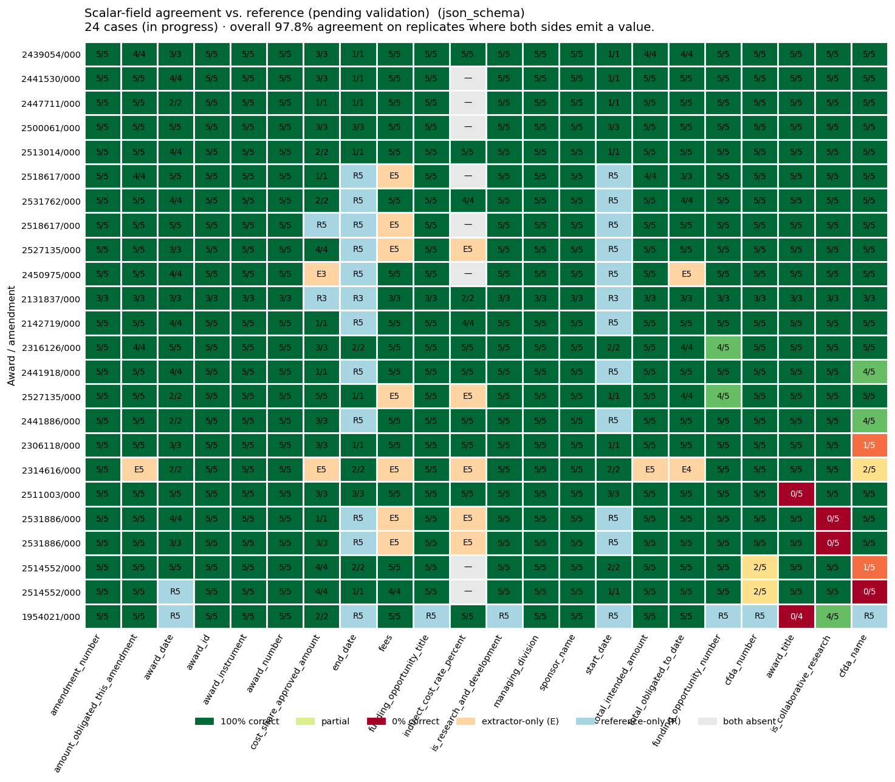
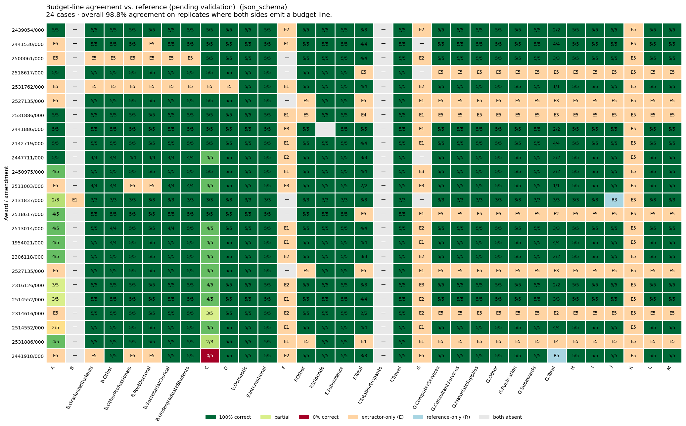

# Extraction accuracy — NSF Award Notice Extraction (UDM)

**Generated:** 2026-04-20T20:04:37Z  
**Ground-truth cases:** 20 (0 validated, 24 awaiting validation)  
**Schema:** `components/nsf-award-notice-extraction-udm/schema.json`

> **Ground-truth source.** Cases marked `validated` are human-verified extractions used as truth. Cases marked `in_progress` are awaiting human verification — the reference values come from an automated second-opinion pipeline, so they serve as an agreement signal rather than an accuracy signal. Validation state is tracked in per-case `metadata.yaml` and partitioned below.

## 1. Headline — accuracy on validated cases

_No cases have completed human validation yet. Every case currently falls into the in-progress partition in §2. As you validate cases (flip `validation_state: validated` in their `metadata.yaml`), they will appear here._

## 2. Pending validation — agreement on in-progress cases

These 24 cases are still awaiting human verification. Numbers below measure **agreement with the automated reference pipeline**, not accuracy. Use them to spot candidate-for-review items — where the extractor and the reference differ, one of them is wrong.

### Scalar fields

24 in-progress cases · overall **97.8%** agreement (2088/2134 replicate-field pairs).

### Budget line items

Overall **98.8%** budget-line agreement (2574/2605 replicate-slot pairs).

## 3. Headline by run mode

| run / mode | matched cases | scalar compared / correct | scalar accuracy | budget compared / correct | budget accuracy |
|---|---|---|---|---|---|
| `none` | 24 of 28 source docs (0 validated, 24 in progress) | 1848 / 1900 | **97.3%** | 2578 / 2660 | **96.9%** |
| `json_object` | 24 of 28 source docs (0 validated, 24 in progress) | 1916 / 1952 | **98.2%** | 2615 / 2658 | **98.4%** |
| `json_schema` | 24 of 28 source docs (0 validated, 24 in progress) | 2088 / 2134 | **97.8%** | 2574 / 2605 | **98.8%** |

## 4. Incorrect-extraction examples — `json_schema`

Up to 5 examples per field where the extractor produced a value different from the reference. Includes both validated (definite errors) and in-progress (candidate errors) cases.

### `cfda_name` — 84%  (95/113)

| award | truth | extractor | truth raw | extractor raw |
|---|---|---|---|---|
| 2441918 | `engineering grants (predominant source of funding for sefa reporting)` | `engineering grants (predominant source for sefa reporting)` | Engineering Grants (Predominant source of funding for SEFA r | Engineering Grants (Predominant source for SEFA reporting) |
| 2514552 | `geosciences (predominant source of funding for sefa reporting), 47.076 education and human resources` | `geosciences (predominant source of funding for sefa reporting); education and human resources` | Geosciences (Predominant source of funding for SEFA reportin | Geosciences (Predominant source of funding for SEFA reportin |
| 2514552 | `geosciences (predominant source of funding for sefa reporting), 47.076 education and human resources` | `geosciences (predominant source of funding for sefa reporting)` | Geosciences (Predominant source of funding for SEFA reportin | Geosciences (Predominant source of funding for SEFA reportin |
| 2514552 | `geosciences (predominant source of funding for sefa reporting), 47.076 education and human resources` | `geosciences (predominant source of funding for sefa reporting); education and human resources` | Geosciences (Predominant source of funding for SEFA reportin | Geosciences (Predominant source of funding for SEFA reportin |
| 2514552 | `geosciences (predominant source of funding for sefa reporting), 47.076 education and human resources` | `geosciences (predominant source of funding for sefa reporting); education and human resources` | Geosciences (Predominant source of funding for SEFA reportin | Geosciences (Predominant source of funding for SEFA reportin |

### `is_collaborative_research` — 91%  (107/118)

| award | truth | extractor | truth raw | extractor raw |
|---|---|---|---|---|
| 2531886 | `False` | `True` | False | True |
| 2531886 | `False` | `True` | False | True |
| 2531886 | `False` | `True` | False | True |
| 2531886 | `False` | `True` | False | True |
| 2531886 | `False` | `True` | False | True |

### `award_title` — 92%  (108/117)

| award | truth | extractor | truth raw | extractor raw |
|---|---|---|---|---|
| 2511003 | `equipment: mri: track 1 acquisition of element aviti system to enable multi-omics research and research training.` | `equipment: mri: track 1 acquisition of element a viti system to enable multi-omics research and research training` | Equipment: MRI: Track 1 Acquisition of Element AVITI System  | Equipment: MRI: Track 1 Acquisition of Element A VITI System |
| 2511003 | `equipment: mri: track 1 acquisition of element aviti system to enable multi-omics research and research training.` | `equipment: mri: track 1 acquisition of element a viti system to enable multi-omics research and research training` | Equipment: MRI: Track 1 Acquisition of Element AVITI System  | Equipment: MRI: Track 1 Acquisition of Element A VITI System |
| 2511003 | `equipment: mri: track 1 acquisition of element aviti system to enable multi-omics research and research training.` | `equipment: mri: track 1 acquisition of element a viti system to enable multi-omics research and research training` | Equipment: MRI: Track 1 Acquisition of Element AVITI System  | Equipment: MRI: Track 1 Acquisition of Element A VITI System |
| 2511003 | `equipment: mri: track 1 acquisition of element aviti system to enable multi-omics research and research training.` | `equipment: mri: track 1 acquisition of element a viti system to enable multi-omics research and research training` | Equipment: MRI: Track 1 Acquisition of Element AVITI System  | Equipment: MRI: Track 1 Acquisition of Element A VITI System |
| 2511003 | `equipment: mri: track 1 acquisition of element aviti system to enable multi-omics research and research training.` | `equipment: mri: track 1 acquisition of element a viti system to enable multi-omics research and research training` | Equipment: MRI: Track 1 Acquisition of Element AVITI System  | Equipment: MRI: Track 1 Acquisition of Element A VITI System |

### `cfda_number` — 95%  (107/113)

| award | truth | extractor | truth raw | extractor raw |
|---|---|---|---|---|
| 2514552 | `47.050` | `47.050, 47.076` | 47.050 | 47.050, 47.076 |
| 2514552 | `47.050` | `47.050; 47.076` | 47.050 | 47.050; 47.076 |
| 2514552 | `47.050` | `47.050, 47.076` | 47.050 | 47.050, 47.076 |
| 2514552 | `47.050` | `47.050, 47.076` | 47.050 | 47.050, 47.076 |
| 2514552 | `47.050` | `47.050; 47.076` | 47.050 | 47.050; 47.076 |

### `funding_opportunity_number` — 98%  (111/113)

| award | truth | extractor | truth raw | extractor raw |
|---|---|---|---|---|
| 2527135 | `nsf 25-509` | `25-509` | NSF 25-509 | 25-509 |
| 2316126 | `nsf 22-633` | `22-633` | NSF 22-633 | 22-633 |

## 5. Appendix — per-field rollup tables across modes

Scalar field accuracy/agreement by mode

| field | `none` | `json_object` | `json_schema` |
|---|---|---|---|
| `sponsor_award_number` | — | — | — |
| `award_status` | — | — | — |
| `proposal_number` | — | — | — |
| `amendment_type` | — | — | — |
| `amendment_date` | — | — | — |
| `amendment_description` | — | — | — |
| `award_received_date` | — | — | — |
| `start_date` | — | — | 100%  (19/19) |
| `end_date` | — | — | 100%  (19/19) |
| `total_intended_amount` | — | — | 100%  (111/111) |
| `expenditure_limitation` | — | — | — |
| `indirect_cost_base` | — | — | — |
| `fees` | — | 100%  (85/85) | 100%  (82/82) |
| `cfda_name` | 84%  (96/115) | 87%  (100/115) | 84%  (95/113) |
| `cfda_number` | 90%  (103/115) | 96%  (110/115) | 95%  (107/113) |
| `is_collaborative_research` | 91%  (109/120) | 92%  (110/120) | 91%  (107/118) |
| `award_title` | 96%  (110/115) | 96%  (110/115) | 92%  (108/117) |
| `funding_opportunity_number` | 96%  (110/115) | 99%  (114/115) | 98%  (111/113) |
| `award_id` | 100%  (120/120) | 100%  (120/120) | 100%  (118/118) |
| `award_number` | 100%  (120/120) | 100%  (120/120) | 100%  (118/118) |
| `sponsor_name` | 100%  (120/120) | 100%  (120/120) | 100%  (118/118) |
| `managing_division` | 100%  (120/120) | 100%  (120/120) | 100%  (118/118) |
| `award_instrument` | 100%  (120/120) | 100%  (120/120) | 100%  (118/118) |
| `is_research_and_development` | 100%  (115/115) | 100%  (115/115) | 100%  (113/113) |
| `funding_opportunity_title` | 100%  (115/115) | 100%  (115/115) | 100%  (113/113) |
| `amendment_number` | 100%  (120/120) | 100%  (120/120) | 100%  (118/118) |
| `award_date` | 100%  (92/92) | 100%  (77/77) | 100%  (81/81) |
| `amount_obligated_this_amendment` | 100%  (115/115) | 100%  (115/115) | 100%  (110/110) |
| `total_obligated_to_date` | 100%  (2/2) | 100%  (2/2) | 100%  (102/102) |
| `cost_share_approved_amount` | 100%  (106/106) | 100%  (88/88) | 100%  (52/52) |
| `indirect_cost_rate_percent` | 100%  (55/55) | 100%  (55/55) | 100%  (50/50) |

One-sided emissions (coverage asymmetry)

Extractor emitted a value where truth/reference has null (**hallucinated**) vs. truth/reference has a value the extractor emitted as null (**missing**). Per mode.

| field | `none` halluc. / missing | `json_object` halluc. / missing | `json_schema` halluc. / missing |
|---|---|---|---|
| `sponsor_award_number` | — | — | — |
| `award_status` | — | — | — |
| `proposal_number` | — | — | — |
| `amendment_type` | 120 / 0 | 120 / 0 | 118 / 0 |
| `amendment_date` | 20 / 0 | 9 / 0 | — |
| `amendment_description` | 120 / 0 | 120 / 0 | 118 / 0 |
| `award_received_date` | 20 / 0 | 20 / 0 | 20 / 0 |
| `start_date` | 0 / 120 | 0 / 120 | 0 / 99 |
| `end_date` | 0 / 120 | 0 / 120 | 0 / 99 |
| `total_intended_amount` | 0 / 115 | 0 / 115 | 5 / 2 |
| `expenditure_limitation` | — | — | 1 / 0 |
| `indirect_cost_base` | 114 / 0 | 113 / 0 | 103 / 0 |
| `fees` | 0 / 85 | 35 / 0 | 35 / 1 |
| `cfda_name` | 0 / 5 | 0 / 5 | 0 / 5 |
| `cfda_number` | 0 / 5 | 0 / 5 | 0 / 5 |
| `is_collaborative_research` | 0 / 0 | 0 / 0 | 0 / 0 |
| `award_title` | 0 / 5 | 0 / 5 | 0 / 1 |
| `funding_opportunity_number` | 0 / 5 | 0 / 5 | 0 / 5 |
| `award_id` | 0 / 0 | 0 / 0 | 0 / 0 |
| `award_number` | 0 / 0 | 0 / 0 | 0 / 0 |
| `sponsor_name` | 0 / 0 | 0 / 0 | 0 / 0 |
| `managing_division` | 0 / 0 | 0 / 0 | 0 / 0 |
| `award_instrument` | 0 / 0 | 0 / 0 | 0 / 0 |
| `is_research_and_development` | 0 / 5 | 0 / 5 | 0 / 5 |
| `funding_opportunity_title` | 0 / 5 | 0 / 5 | 0 / 5 |
| `amendment_number` | 0 / 0 | 0 / 0 | 0 / 0 |
| `award_date` | 0 / 28 | 0 / 43 | 0 / 37 |
| `amount_obligated_this_amendment` | 5 / 0 | 5 / 0 | 5 / 3 |
| `total_obligated_to_date` | 0 / 108 | 0 / 108 | 9 / 6 |
| `cost_share_approved_amount` | 10 / 4 | 7 / 22 | 8 / 56 |
| `indirect_cost_rate_percent` | 25 / 0 | 25 / 0 | 25 / 3 |

Budget-line accuracy/agreement by mode

Rows are NSF-format `code.subcode` slots. Columns show **correct / compared** replicate-slot pairs per mode.

| slot | `none` | `json_object` | `json_schema` |
|---|---|---|---|
| `A` | 60%  (48/80) | 79%  (63/80) | 82%  (64/78) |
| `B` | — | — | — |
| `B.GraduateStudents` | 100%  (103/103) | 100%  (105/105) | 100%  (101/101) |
| `B.Other` | 100%  (107/107) | 100%  (107/107) | 100%  (104/104) |
| `B.OtherProfessionals` | 100%  (98/98) | 100%  (100/100) | 100%  (97/97) |
| `B.PostDoctoral` | 100%  (93/93) | 100%  (95/95) | 100%  (92/92) |
| `B.SecretarialClerical` | 100%  (108/108) | 100%  (108/108) | 100%  (105/105) |
| `B.UndergraduateStudents` | 100%  (108/108) | 100%  (110/110) | 100%  (106/106) |
| `C` | 56%  (65/115) | 77%  (88/114) | 85%  (94/111) |
| `D` | 100%  (115/115) | 100%  (115/115) | 100%  (113/113) |
| `E.Domestic` | 100%  (120/120) | 100%  (120/120) | 100%  (118/118) |
| `E.International` | 100%  (120/120) | 100%  (120/120) | 100%  (118/118) |
| `F` | — | — | — |
| `F.Other` | 100%  (100/100) | 100%  (100/100) | 100%  (98/98) |
| `F.Stipends` | 100%  (115/115) | 100%  (115/115) | 100%  (113/113) |
| `F.Subsistence` | 100%  (120/120) | 100%  (120/120) | 100%  (118/118) |
| `F.Total` | 100%  (62/62) | 100%  (57/57) | 100%  (63/63) |
| `F.Travel` | 100%  (120/120) | 100%  (120/120) | 100%  (118/118) |
| `G` | — | — | — |
| `G.ComputerServices` | 100%  (85/85) | 100%  (85/85) | 100%  (83/83) |
| `G.ConsultantServices` | 100%  (85/85) | 100%  (85/85) | 100%  (83/83) |
| `G.MaterialsSupplies` | 100%  (85/85) | 100%  (85/85) | 100%  (83/83) |
| `G.Other` | 100%  (85/85) | 100%  (85/85) | 100%  (83/83) |
| `G.Publication` | 100%  (85/85) | 100%  (85/85) | 100%  (83/83) |
| `G.Subawards` | 100%  (85/85) | 100%  (85/85) | 100%  (83/83) |
| `G.Total` | 100%  (46/46) | 100%  (42/42) | 100%  (42/42) |
| `H` | 100%  (85/85) | 100%  (85/85) | 100%  (83/83) |
| `I` | 100%  (85/85) | 100%  (85/85) | 100%  (83/83) |
| `J` | 100%  (80/80) | 100%  (80/80) | 100%  (80/80) |
| `K` | — | — | — |
| `L` | 100%  (85/85) | 100%  (85/85) | 100%  (83/83) |
| `M` | 100%  (85/85) | 100%  (85/85) | 100%  (83/83) |

## Methodology

- **Matching.** Source documents are matched to ground-truth cases by the tuple `(award_number, amendment_number)`, majority-voted across replicates. This matters for amendment series: three source documents may share an `award_number` but represent the base award, Mod 1, and Mod 2 respectively.
- **Validation partition.** Each ground-truth case carries a sibling `<results-N>.meta.yaml` file with `validation_state: validated | in_progress`. Validated cases feed the §1 headline; in-progress cases feed the §2 appendix. As cases are validated, they migrate from §2 to §1 without any code change.
- **Scoring.** Every (award × field × replicate) tuple is assigned exactly one of: `correct`, `incorrect`, `hallucinated` (extractor emitted; truth null), `missing` (truth emitted; extractor null), `correct_absent` (both null). Accuracy percentages use `correct / (correct + incorrect)` — i.e., only replicates where both sides emit a value. Hallucination and missing counts are surfaced separately (orange/blue cells in the heatmaps, §5 in the appendix tables).
- **Scalar scope.** All top-level scalar fields declared in the UDM schema.
- **Budget scope.** The `budget_categories` array is compared by `(code, subcode)` — both sides already emit native UDM shape, so no label mapping is required. The top-level `fees` scalar is also scored. Nested objects (`recipient_organization`, `current_budget_period`) and other arrays (`project_personnel`, `subawards`, `terms_and_conditions`, `special_conditions`) remain out of scope for this pass.
- **Normalization.** Currency (`$584,845` → `584845`), percentages (`50.0000%` → `50.0`), US dates (`08/18/2025` → `2025-08-18`) are coerced. `"N/A"`, `""`, and `null` are all treated as null.

**Comparison script:** `scripts/compare_to_vandalizer.py`  
**Plotter:** `scripts/plot_vandalizer_heatmaps.py` (in the prompt-library repo) reads `summary.json` and writes the PNGs under `charts/`. Regenerate with `python scripts/plot_vandalizer_heatmaps.py --summary <path>/summary.json --mode json_schema`.