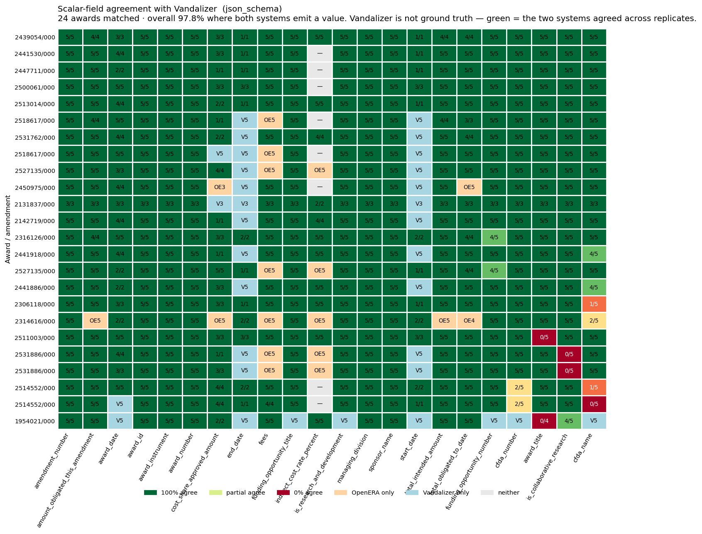
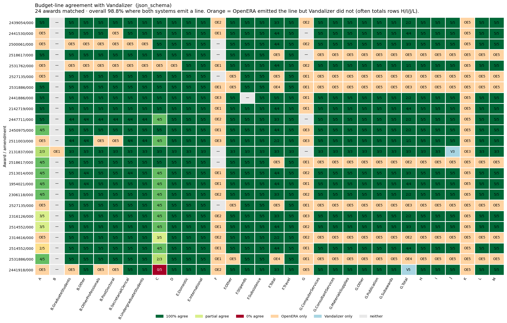

# OpenERA vs. Vandalizer — cross-system agreement

**Generated:** 2026-04-20T19:21:18Z  
**Vandalizer results loaded:** 20 distinct awards  
**Schema:** `components/nsf-award-notice-extraction-udm/schema.json`

> **Not ground truth.** Vandalizer is a separate AI extraction system. Where the two systems agree we have high confidence the value is correct; where they disagree the document is ambiguous or one system is wrong. Treat this as a *second opinion*, not a truth signal.

## 1. Headline — agreement heatmaps

Both heatmaps use the **`json_schema`** run. Rows are awards (sorted by that row's mean agreement), columns are fields (sorted by cross-award agreement). Cell text = `agree / compared` over replicates. **Green** = both systems emitted a value and they matched; **orange** = OpenERA emitted but Vandalizer did not; **blue** = Vandalizer emitted but OpenERA did not; **gray** = neither emitted.

### Scalar fields

24 awards matched · overall **97.8%** agreement where both systems emit a value (2088/2134 replicate-field pairs).

### Budget line items (NSF-format A–M)

Comparison is by `(code, subcode)` — both systems target the same UDM shape. Overall **98.8%** agreement where both emit a line (2574/2605 replicate-slot pairs). Most orange cells are totals rows (H/I/J/L) OpenERA itemizes explicitly but Vandalizer does not.

## 2. Headline — agreement by run mode

| run / mode | matched awards | scalar compared / agree | scalar agreement | budget compared / agree | budget agreement |
|---|---|---|---|---|---|
| `none` | 24 / 28 openera docs | 1848 / 1900 | **97.3%** | 2578 / 2660 | **96.9%** |
| `json_object` | 24 / 28 openera docs | 1916 / 1952 | **98.2%** | 2615 / 2658 | **98.4%** |
| `json_schema` | 24 / 28 openera docs | 2088 / 2134 | **97.8%** | 2574 / 2605 | **98.8%** |

## 3. Scalar-field disagreement examples — `json_schema`

Up to 5 examples per field. When you see these, ask: was the document ambiguous, did Vandalizer extract the wrong thing, or did OpenERA?

### `cfda_name` — 84% agreement  (95/113)

| award | vandalizer | openera | vandalizer raw | openera raw |
|---|---|---|---|---|
| 2441918 | `engineering grants (predominant source of funding for sefa reporting)` | `engineering grants (predominant source for sefa reporting)` | Engineering Grants (Predominant source of funding for SEFA r | Engineering Grants (Predominant source for SEFA reporting) |
| 2514552 | `geosciences (predominant source of funding for sefa reporting), 47.076 education and human resources` | `geosciences (predominant source of funding for sefa reporting); education and human resources` | Geosciences (Predominant source of funding for SEFA reportin | Geosciences (Predominant source of funding for SEFA reportin |
| 2514552 | `geosciences (predominant source of funding for sefa reporting), 47.076 education and human resources` | `geosciences (predominant source of funding for sefa reporting)` | Geosciences (Predominant source of funding for SEFA reportin | Geosciences (Predominant source of funding for SEFA reportin |
| 2514552 | `geosciences (predominant source of funding for sefa reporting), 47.076 education and human resources` | `geosciences (predominant source of funding for sefa reporting); education and human resources` | Geosciences (Predominant source of funding for SEFA reportin | Geosciences (Predominant source of funding for SEFA reportin |
| 2514552 | `geosciences (predominant source of funding for sefa reporting), 47.076 education and human resources` | `geosciences (predominant source of funding for sefa reporting); education and human resources` | Geosciences (Predominant source of funding for SEFA reportin | Geosciences (Predominant source of funding for SEFA reportin |

### `is_collaborative_research` — 91% agreement  (107/118)

| award | vandalizer | openera | vandalizer raw | openera raw |
|---|---|---|---|---|
| 2531886 | `False` | `True` | False | True |
| 2531886 | `False` | `True` | False | True |
| 2531886 | `False` | `True` | False | True |
| 2531886 | `False` | `True` | False | True |
| 2531886 | `False` | `True` | False | True |

### `award_title` — 92% agreement  (108/117)

| award | vandalizer | openera | vandalizer raw | openera raw |
|---|---|---|---|---|
| 2511003 | `equipment: mri: track 1 acquisition of element aviti system to enable multi-omics research and research training.` | `equipment: mri: track 1 acquisition of element a viti system to enable multi-omics research and research training` | Equipment: MRI: Track 1 Acquisition of Element AVITI System  | Equipment: MRI: Track 1 Acquisition of Element A VITI System |
| 2511003 | `equipment: mri: track 1 acquisition of element aviti system to enable multi-omics research and research training.` | `equipment: mri: track 1 acquisition of element a viti system to enable multi-omics research and research training` | Equipment: MRI: Track 1 Acquisition of Element AVITI System  | Equipment: MRI: Track 1 Acquisition of Element A VITI System |
| 2511003 | `equipment: mri: track 1 acquisition of element aviti system to enable multi-omics research and research training.` | `equipment: mri: track 1 acquisition of element a viti system to enable multi-omics research and research training` | Equipment: MRI: Track 1 Acquisition of Element AVITI System  | Equipment: MRI: Track 1 Acquisition of Element A VITI System |
| 2511003 | `equipment: mri: track 1 acquisition of element aviti system to enable multi-omics research and research training.` | `equipment: mri: track 1 acquisition of element a viti system to enable multi-omics research and research training` | Equipment: MRI: Track 1 Acquisition of Element AVITI System  | Equipment: MRI: Track 1 Acquisition of Element A VITI System |
| 2511003 | `equipment: mri: track 1 acquisition of element aviti system to enable multi-omics research and research training.` | `equipment: mri: track 1 acquisition of element a viti system to enable multi-omics research and research training` | Equipment: MRI: Track 1 Acquisition of Element AVITI System  | Equipment: MRI: Track 1 Acquisition of Element A VITI System |

### `cfda_number` — 95% agreement  (107/113)

| award | vandalizer | openera | vandalizer raw | openera raw |
|---|---|---|---|---|
| 2514552 | `47.050` | `47.050, 47.076` | 47.050 | 47.050, 47.076 |
| 2514552 | `47.050` | `47.050; 47.076` | 47.050 | 47.050; 47.076 |
| 2514552 | `47.050` | `47.050, 47.076` | 47.050 | 47.050, 47.076 |
| 2514552 | `47.050` | `47.050, 47.076` | 47.050 | 47.050, 47.076 |
| 2514552 | `47.050` | `47.050; 47.076` | 47.050 | 47.050; 47.076 |

### `funding_opportunity_number` — 98% agreement  (111/113)

| award | vandalizer | openera | vandalizer raw | openera raw |
|---|---|---|---|---|
| 2527135 | `nsf 25-509` | `25-509` | NSF 25-509 | 25-509 |
| 2316126 | `nsf 22-633` | `22-633` | NSF 22-633 | 22-633 |

## 4. Appendix — per-field rollup tables across modes

Scalar fields where both systems provided a value. Columns show **agree / compared** per mode.

Scalar field agreement by mode

| field | `none` | `json_object` | `json_schema` |
|---|---|---|---|
| `sponsor_award_number` | — | — | — |
| `award_status` | — | — | — |
| `proposal_number` | — | — | — |
| `amendment_type` | — | — | — |
| `amendment_date` | — | — | — |
| `amendment_description` | — | — | — |
| `award_received_date` | — | — | — |
| `start_date` | — | — | 100%  (19/19) |
| `end_date` | — | — | 100%  (19/19) |
| `total_intended_amount` | — | — | 100%  (111/111) |
| `expenditure_limitation` | — | — | — |
| `indirect_cost_base` | — | — | — |
| `fees` | — | 100%  (85/85) | 100%  (82/82) |
| `cfda_name` | 84%  (96/115) | 87%  (100/115) | 84%  (95/113) |
| `cfda_number` | 90%  (103/115) | 96%  (110/115) | 95%  (107/113) |
| `is_collaborative_research` | 91%  (109/120) | 92%  (110/120) | 91%  (107/118) |
| `award_title` | 96%  (110/115) | 96%  (110/115) | 92%  (108/117) |
| `funding_opportunity_number` | 96%  (110/115) | 99%  (114/115) | 98%  (111/113) |
| `award_id` | 100%  (120/120) | 100%  (120/120) | 100%  (118/118) |
| `award_number` | 100%  (120/120) | 100%  (120/120) | 100%  (118/118) |
| `sponsor_name` | 100%  (120/120) | 100%  (120/120) | 100%  (118/118) |
| `managing_division` | 100%  (120/120) | 100%  (120/120) | 100%  (118/118) |
| `award_instrument` | 100%  (120/120) | 100%  (120/120) | 100%  (118/118) |
| `is_research_and_development` | 100%  (115/115) | 100%  (115/115) | 100%  (113/113) |
| `funding_opportunity_title` | 100%  (115/115) | 100%  (115/115) | 100%  (113/113) |
| `amendment_number` | 100%  (120/120) | 100%  (120/120) | 100%  (118/118) |
| `award_date` | 100%  (92/92) | 100%  (77/77) | 100%  (81/81) |
| `amount_obligated_this_amendment` | 100%  (115/115) | 100%  (115/115) | 100%  (110/110) |
| `total_obligated_to_date` | 100%  (2/2) | 100%  (2/2) | 100%  (102/102) |
| `cost_share_approved_amount` | 100%  (106/106) | 100%  (88/88) | 100%  (52/52) |
| `indirect_cost_rate_percent` | 100%  (55/55) | 100%  (55/55) | 100%  (50/50) |

Scalar one-sided nulls (coverage asymmetry)

Cases where one system extracted a value and the other returned null.

| field | `none` OE-null / van-null | `json_object` OE-null / van-null | `json_schema` OE-null / van-null |
|---|---|---|---|
| `sponsor_award_number` | — | — | — |
| `award_status` | — | — | — |
| `proposal_number` | — | — | — |
| `amendment_type` | 0 / 120 | 0 / 120 | 0 / 118 |
| `amendment_date` | 0 / 20 | 0 / 9 | — |
| `amendment_description` | 0 / 120 | 0 / 120 | 0 / 118 |
| `award_received_date` | 0 / 20 | 0 / 20 | 0 / 20 |
| `start_date` | 120 / 0 | 120 / 0 | 99 / 0 |
| `end_date` | 120 / 0 | 120 / 0 | 99 / 0 |
| `total_intended_amount` | 115 / 0 | 115 / 0 | 2 / 5 |
| `expenditure_limitation` | — | — | 0 / 1 |
| `indirect_cost_base` | 0 / 114 | 0 / 113 | 0 / 103 |
| `fees` | 85 / 0 | 0 / 35 | 1 / 35 |
| `cfda_name` | 5 / 0 | 5 / 0 | 5 / 0 |
| `cfda_number` | 5 / 0 | 5 / 0 | 5 / 0 |
| `is_collaborative_research` | 0 / 0 | 0 / 0 | 0 / 0 |
| `award_title` | 5 / 0 | 5 / 0 | 1 / 0 |
| `funding_opportunity_number` | 5 / 0 | 5 / 0 | 5 / 0 |
| `award_id` | 0 / 0 | 0 / 0 | 0 / 0 |
| `award_number` | 0 / 0 | 0 / 0 | 0 / 0 |
| `sponsor_name` | 0 / 0 | 0 / 0 | 0 / 0 |
| `managing_division` | 0 / 0 | 0 / 0 | 0 / 0 |
| `award_instrument` | 0 / 0 | 0 / 0 | 0 / 0 |
| `is_research_and_development` | 5 / 0 | 5 / 0 | 5 / 0 |
| `funding_opportunity_title` | 5 / 0 | 5 / 0 | 5 / 0 |
| `amendment_number` | 0 / 0 | 0 / 0 | 0 / 0 |
| `award_date` | 28 / 0 | 43 / 0 | 37 / 0 |
| `amount_obligated_this_amendment` | 0 / 5 | 0 / 5 | 3 / 5 |
| `total_obligated_to_date` | 108 / 0 | 108 / 0 | 6 / 9 |
| `cost_share_approved_amount` | 4 / 10 | 22 / 7 | 56 / 8 |
| `indirect_cost_rate_percent` | 0 / 25 | 0 / 25 | 3 / 25 |

Budget-line agreement by mode

Rows are NSF-format `code.subcode` slots. Columns show **agree / compared** replicate-slot pairs per mode.

| slot | `none` | `json_object` | `json_schema` |
|---|---|---|---|
| `A` | 60%  (48/80) | 79%  (63/80) | 82%  (64/78) |
| `B` | — | — | — |
| `B.GraduateStudents` | 100%  (103/103) | 100%  (105/105) | 100%  (101/101) |
| `B.Other` | 100%  (107/107) | 100%  (107/107) | 100%  (104/104) |
| `B.OtherProfessionals` | 100%  (98/98) | 100%  (100/100) | 100%  (97/97) |
| `B.PostDoctoral` | 100%  (93/93) | 100%  (95/95) | 100%  (92/92) |
| `B.SecretarialClerical` | 100%  (108/108) | 100%  (108/108) | 100%  (105/105) |
| `B.UndergraduateStudents` | 100%  (108/108) | 100%  (110/110) | 100%  (106/106) |
| `C` | 56%  (65/115) | 77%  (88/114) | 85%  (94/111) |
| `D` | 100%  (115/115) | 100%  (115/115) | 100%  (113/113) |
| `E.Domestic` | 100%  (120/120) | 100%  (120/120) | 100%  (118/118) |
| `E.International` | 100%  (120/120) | 100%  (120/120) | 100%  (118/118) |
| `F` | — | — | — |
| `F.Other` | 100%  (100/100) | 100%  (100/100) | 100%  (98/98) |
| `F.Stipends` | 100%  (115/115) | 100%  (115/115) | 100%  (113/113) |
| `F.Subsistence` | 100%  (120/120) | 100%  (120/120) | 100%  (118/118) |
| `F.Total` | 100%  (62/62) | 100%  (57/57) | 100%  (63/63) |
| `F.Travel` | 100%  (120/120) | 100%  (120/120) | 100%  (118/118) |
| `G` | — | — | — |
| `G.ComputerServices` | 100%  (85/85) | 100%  (85/85) | 100%  (83/83) |
| `G.ConsultantServices` | 100%  (85/85) | 100%  (85/85) | 100%  (83/83) |
| `G.MaterialsSupplies` | 100%  (85/85) | 100%  (85/85) | 100%  (83/83) |
| `G.Other` | 100%  (85/85) | 100%  (85/85) | 100%  (83/83) |
| `G.Publication` | 100%  (85/85) | 100%  (85/85) | 100%  (83/83) |
| `G.Subawards` | 100%  (85/85) | 100%  (85/85) | 100%  (83/83) |
| `G.Total` | 100%  (46/46) | 100%  (42/42) | 100%  (42/42) |
| `H` | 100%  (85/85) | 100%  (85/85) | 100%  (83/83) |
| `I` | 100%  (85/85) | 100%  (85/85) | 100%  (83/83) |
| `J` | 100%  (80/80) | 100%  (80/80) | 100%  (80/80) |
| `K` | — | — | — |
| `L` | 100%  (85/85) | 100%  (85/85) | 100%  (83/83) |
| `M` | 100%  (85/85) | 100%  (85/85) | 100%  (83/83) |

## Methodology

- **Matching.** OpenERA PDFs are matched to Vandalizer results by the tuple `(award_number, amendment_number)`, majority-voted across replicates. This matters for amendment series: three PDFs may share an award_number but represent the base award, Mod 1, and Mod 2 respectively; matching on award_number alone would falsely align all three to one Vandalizer extraction.
- **Scalar scope.** All top-level scalar fields declared in the UDM schema.
- **Budget scope.** The `budget_categories` array is compared by `(code, subcode)` — both systems already emit native UDM shape, so no label mapping is required. The top-level `fees` scalar is also scored. Nested objects (`recipient_organization`, `current_budget_period`) and other arrays (`project_personnel`, `subawards`, `terms_and_conditions`, `special_conditions`) remain out of scope for this pass.
- **Normalization.** Currency (`$584,845` → `584845`), percentages (`50.0000%` → `50.0`), US dates (`08/18/2025` → `2025-08-18`) are coerced. `"N/A"`, `""`, and `null` are all treated as null.
- **Denominator.** Every agreement percentage uses only replicates where *both* systems produced a non-null value for that field / budget slot. One-sided emissions are surfaced separately (orange / blue cells in the heatmaps, appendix §4 for the table equivalents) so they do not penalize agreement.

**Comparison script:** `scripts/compare_to_vandalizer.py`  
**Plotter:** `scripts/plot_vandalizer_heatmaps.py` (in this repo) reads `summary.json` and writes the PNGs under `charts/`. Regenerate with `python scripts/plot_vandalizer_heatmaps.py --summary <path>/summary.json --mode json_schema`.