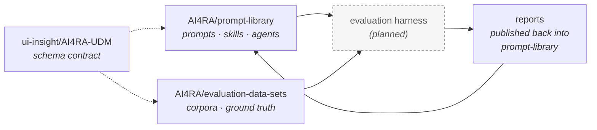

# The AI4RA evaluation ecosystem

The AI4RA ecosystem is a set of coordinated repositories, each with a single concern. This page is the map: what each one does, what it doesn't, and how they fit together. If you've landed on any one of these repos and need to understand how your work connects to the rest, start here.

## At a glance

Solid arrows are concrete data flows; dotted arrows show contract relationships ("honors the schema defined in…"). The harness node is dashed because it is planned but not yet built.

## The four repositories

### [AI4RA/prompt-library](https://github.com/AI4RA/prompt-library) — _this site_

**What it is.** The versioned catalog. Every prompt, skill, and agent for research-administration work lives here with a schema, a changelog, and a generated home page. Each component follows semver independently; manifestations (raw prompt, Claude Skill, agent) stay in lockstep within a component. Evaluation reports are rendered inline on each component page so the library serves as both catalog and evidence.

**What it isn't.** The runtime that executes prompts at inference time. The corpus of inputs used to evaluate them. A consumer application.

### [AI4RA/evaluation-data-sets](https://github.com/AI4RA/evaluation-data-sets)

**What it is.** Synthetic and real corpora for exercising the catalog. Each dataset carries its own README with provenance, schema, and usage notes. Synthetic sets (fabricated personas, documents, ground truth) are safe to share. Real sets live under `real/` with authorization gates — they often contain recipient-identifying information or document content that can't be redistributed.

**What it isn't.** A catalog of prompts. A runtime. The prompts that extract from these datasets live in the prompt library, not here.

### [ui-insight/AI4RA-UDM](https://github.com/ui-insight/AI4RA-UDM)

**What it is.** The canonical **Unified Data Model** — the relational schema for research-administration entities (Award, Modification, AwardBudget, Subaward, terms and conditions, etc.). It's the stable contract that extraction outputs and dataset ground truth both target.

**What it isn't.** Owned by AI4RA. It's authored and maintained by ui-insight. The prompt library's per-component `schema.json` files are output contracts *aligned with* the UDM's semantics; the datasets' structured records are shaped to *ingest into* the UDM. Neither repo redefines it. Schema changes with UDM implications are discussed in issues on the UDM repo before landing downstream.

### Evaluation harness _(planned)_

**What it is.** A project-agnostic runner that binds a prompt catalog + a dataset + a UDM contract into reproducible campaigns, compares extractions to ground truth using a five-status field diff (`correct` / `incorrect` / `hallucinated` / `missing` / `correct_absent`), and publishes reports back into the prompt library.

**Current state.** Not yet implemented as a standalone repo. A bespoke harness for a specific consumer exists elsewhere and is the design basis for this forthcoming project-agnostic version. The interim comparison scripts that produced today's reports are sidecar tools, not the intended long-term runner.

## How a report gets made

1. **A campaign is defined.** Which prompt (a pinned `prompt-library/components/<slug>/@<version>`) runs against which dataset (a pinned `evaluation-data-sets/<path>@<sha>`), under which model configuration, with how many replicates.
2. **The harness runs the campaign.** It pulls vendored copies of the prompt and the dataset, executes replicated extractions against the model, and writes per-replicate outputs to its local lab-notebook store.
3. **Extractions are scored against ground truth.** For each (document × field × replicate) tuple, the harness emits one of the five statuses above. Validated ground truth feeds an accuracy headline; cases still awaiting human validation feed an agreement-only appendix. As validation progresses, cases migrate from appendix to headline without any code change.
4. **Reports are published back into the prompt library** under `components/<slug>/evals/reports/<run-id>/`. The library's MkDocs site renders them inline on the component page, with charts co-located. See the [NSF Award Notice Extraction component](components/nsf-award-notice-extraction-udm.md) for a worked example.

## Ground truth, in detail

Not every dataset record has human-verified ground truth the day it's added. Each case carries a small metadata file indicating its `validation_state` (`validated` or `in_progress`), the validator's identity, the validation date, and any notes. Reports honor this metadata when partitioning their output, so claims of _accuracy_ are always unambiguous at the moment of reading: they come only from validated cases. Pre-validation cases are still useful — they produce an _agreement_ signal that flags candidate-for-review items — but they're clearly demarcated as such.

## Contributing across repos

A non-trivial piece of work often touches more than one repo. Some typical cross-repo flows:

- **New extraction task**: prompt lands in `prompt-library`; new golden case lands in `evaluation-data-sets` (or is re-used from an existing dataset); if a new UDM field is needed, discuss in an issue on `AI4RA-UDM` first.
- **Schema evolution**: proposal in `AI4RA-UDM` → merged → component `schema.json` files updated with a MAJOR or MINOR bump → dataset records updated to reflect the new shape.
- **New dataset**: dataset lands in `evaluation-data-sets`; if new components are needed to exercise it, they land in `prompt-library`.

Each repo's own **Contributing** guide covers the local procedure; this page covers only the inter-repo coordination rules.
