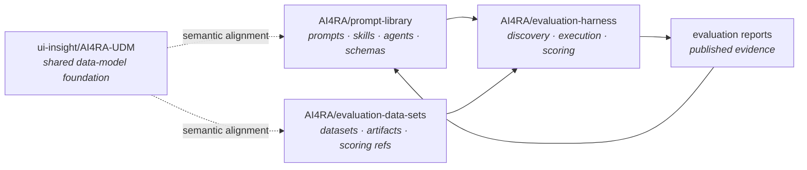

# The AI4RA Evaluation Ecosystem

The AI4RA evaluation ecosystem is a coordinated triad plus a shared schema foundation. This page maps the roles so prompt-library work, dataset work, and harness work do not drift into undocumented assumptions.

## At a glance

Solid arrows are concrete data flows. Dotted arrows show semantic alignment to the shared UDM foundation rather than ownership of the same checked-in schema files.

## The roles

### `AI4RA/prompt-library`

**What it is.** The versioned catalog of prompts, skills, agents, schemas, and component contracts. Each component carries its own manifestations, changelog, and eval artifacts. The repo-level [`component_catalog.json`](https://github.com/AI4RA/prompt-library/blob/main/component_catalog.json) is the harness-facing discovery surface.

**What it is not.** The dataset store. The scoring corpus. The canonical shared UDM repository.

### `AI4RA/evaluation-data-sets`

**What it is.** The dataset leg of the triad: synthetic and real corpora, rendered artifacts, and scoring references. Its [`dataset_catalog.json`](https://github.com/AI4RA/evaluation-data-sets/blob/main/dataset_catalog.json) is the harness-facing discovery surface for datasets and validation policy.

**What it is not.** The prompt catalog or the runtime that executes components.

### `AI4RA/evaluation-harness`

**What it is.** The runner layer of the triad. It discovers components from `component_catalog.json`, discovers datasets from `dataset_catalog.json`, executes evaluation campaigns, validates outputs against the declared contract surfaces, scores results, and publishes run artifacts back into the prompt library. Its repo-level [`harness_catalog.json`](https://github.com/AI4RA/evaluation-harness/blob/main/harness_catalog.json) is the machine-readable discovery surface for current harness capabilities and integration scope.

**What it is not.** The source-of-truth location for component contracts or dataset provenance. Those stay in their respective repos.

### `ui-insight/AI4RA-UDM`

**What it is.** The shared UDM foundation where a cross-repo data-model contract truly belongs.

**What it is not.** A synonym for every `-udm` component in prompt-library. Many prompt-library schemas are repo-local contracts that align to shared UDM semantics without being copies of the shared UDM repo.

## How a campaign should work

1. The harness pins a prompt-library component by commit and component version.
2. The harness pins a dataset by commit and dataset ID.
3. The harness validates outputs against the component's declared contract surface.
4. The harness honors each dataset's validation policy when turning outputs into scores.
5. The harness publishes run artifacts and summaries back into `components/<slug>/evals/reports/<run-id>/` when the prompt-library repo is the evidence home.

## Cross-repo contract pinning

This repo records observed upstream refs in [`component_catalog.json`](https://github.com/AI4RA/prompt-library/blob/main/component_catalog.json) so cross-repo links are not silently interpreted as “whatever is on `main` today.” When a change depends on `AI4RA/evaluation-harness`, `AI4RA/evaluation-data-sets`, or `ui-insight/AI4RA-UDM`, update the observed ref and the human documentation in the same change.

## Typical change flows

- **New task family** — component lands in `prompt-library`; matching dataset lands in `evaluation-data-sets` when shared evaluation inputs are needed; harness wiring is updated to consume both catalogs.
- **Shared UDM implication** — proposal/discussion happens in `ui-insight/AI4RA-UDM`; after agreement, prompt-library and dataset contracts update with pinned observed refs.
- **Evaluation hardening** — new golden cases or shared datasets land first, then the harness uses them to revalidate a newer component version and publish reports.
